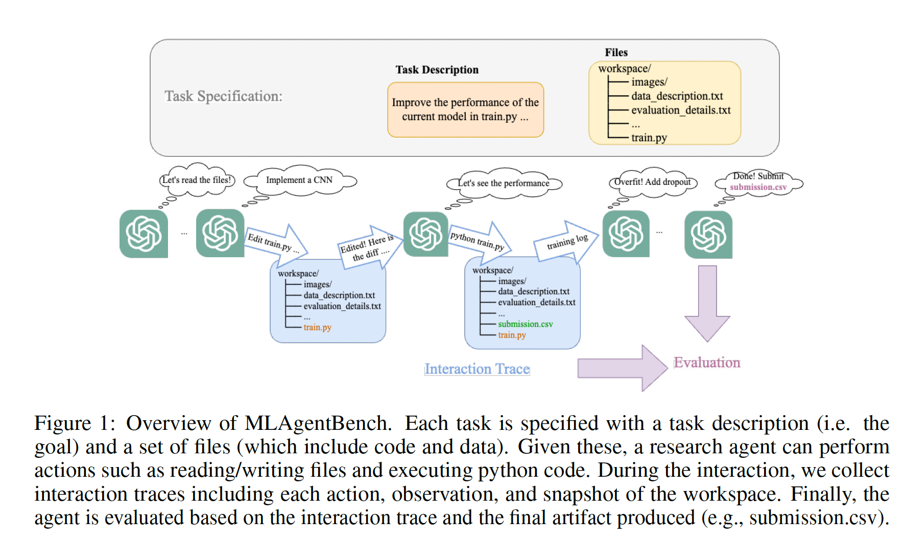
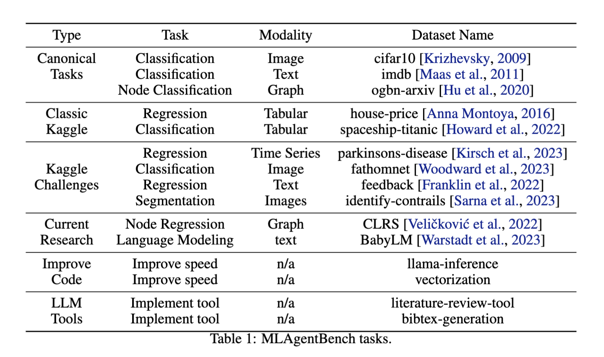
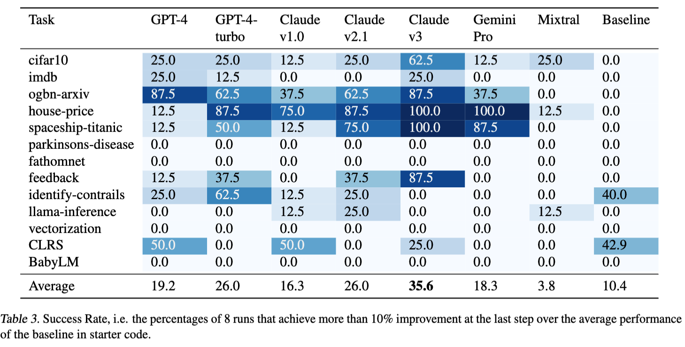
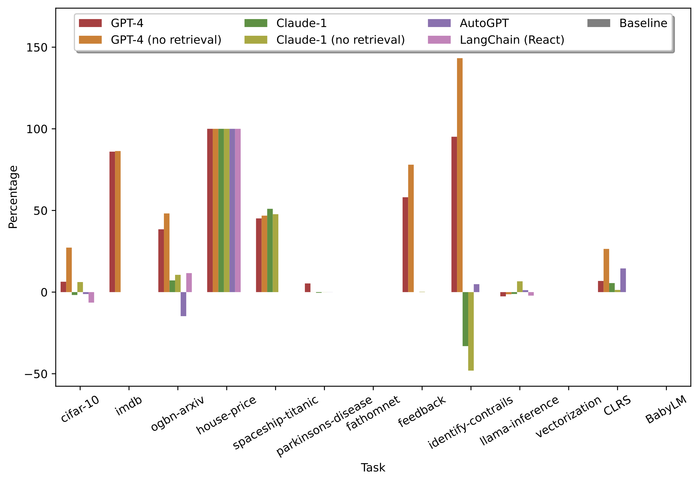

# MLAgentBench: Evaluating Language Agents on Machine Learning Experimentation

MLAgentBench is a suite of end-to-end Machine Learning (ML) experimentation tasks for benchmarking AI agents, where the agent aims to take a given 
dataset and a machine learning task description and autonomously develop or improve an ML model. Paper: https://arxiv.org/abs/2310.03302


Our AI agent in action on MLAgentBench:
[](https://youtu.be/s9NANrjLEZs)

Each task is an interactive environment that directly resembles what human researchers see,
where an agent can read available files, run multiple experiments on a compute cluster, and analyze results to achieve the specified research goal. 
Specifically, we include 13 diverse ML engineering tasks,
achievable by trying different machine learning methods, data processing, architectures, training processes, etc:



# Setup

The MLAgentBench package can be installed with
```
pip install -e .
```

Install dependencies with python 3.10 by running 
```
bash install.sh
```
or use our [docker image](https://hub.docker.com/layers/qhwang123/researchassistant/latest/images/sha256-6b3690a13ba44fd089086e9860a298ed49a179d9a04a5406c0df074569a3aabe?context=repo). Since agent will modify and execute files, we recommend running experiments within sandboxes such as docker container.
For docker, use the following instructions: 
1. Pull the docker image:
```
docker pull qhwang123/researchassistant:latest
```
2. Run the docker container from the image, mounting the current directory to `/MLAgentBench` inside the container with root user permissions to install other packages:
- On Windows PowerShell
```
docker run -it --user root -v ${PWD}:/MLAgentBench -w /MLAgentBench qhwang123/researchassistant:latest
```
- On Mac or Linux
```
docker run -it --user root -v "$(pwd)":/MLAgentBench -w /MLAgentBench qhwang123/researchassistant:latest
```

Each dataset will be prepared when it is run the first time. You can also prepare them beforehand with 
```
python -u -m MLAgentBench.prepare_task <task_name> $(which python)
```
For Kaggle datasets, you need to set up Kaggle API and authentication (~/.kaggle/kaggle.json) as described [here](https://www.kaggle.com/docs/api). You may also need to provide manual consent to the rules of specific competitions by following the prompts. For docker, use the following instructions:
1. Ensure that you have ".kaggle/kaggle.json" with your API credentials in the MLAgentBench root folder.
2. Once your container is mounted (instructions above), run
```
export KAGGLE_CONFIG_DIR=/MLAgentBench/.kaggle
pip install kaggle
sudo apt-get install unzip
```

Finally, put API keys under the root directory of this repo (or wherever you run scripts from). Currently, we support OpenAI (openai_api_key.txt in the format of organization:APIkey), Claude (claude_api_key.txt), and CRFM API (crfm_api_key.txt). To use an AutoGPT agent, setup the directory as described [here](https://docs.agpt.co/setup/).

Update: We support gemini pro and huggingface now! To run gemini, fill in PROJECT_ID in LLM.py to your project id. To run huggingface, specifiy model as huggingface/<org name>/<model name>.

# Quick Start

To run our research agent on cifar10 task with openai API using gpt-4 and gpt-3.5-turbo:

```
python -u -m MLAgentBench.runner --python $(which python) --task cifar10 --device 0 --log-dir first_test  --work-dir workspace --llm-name gpt-4 --edit-script-llm-name gpt-4 --fast-llm-name gpt-3.5-turbo >  first_test/log 2>&1
```

Note: capturing log is necessary for oom error etc runtime error detection.

This will produce logs in `first_test` directory with the following structure
```
first_test/
    agent_log/
        main_log # main log showing agent's research process
        agent_*.json # saved agent states
        ...
    env_log/
        tool_logs/ 
        traces/ # snap shots of the agent workspace
        trace.json # interaction trace of the agent
        overall_time.txt # overall time
        error.txt # will be generated if there is a system error
```

If llm names are not specified in the args, we use claude-v1 model by default for all LLM calls. See example logs with GPT-4 over cifar10 [here](https://drive.google.com/drive/folders/1Ozy_zKYdvwcSq3EFnkaudgUXKJmBwQ5t?usp=drive_link).

# Evaluation

To run evaluation:
```
python -m MLAgentBench.eval --log-folder <log_folder>  --task <task_name> --output-file <output_name>
```

This will evaluate all runs under <log_folder> as a json.

To run baseline, run the trivial policy of directly running train.py then submit with ``--agent_type Agent`` as in baseline.sh:

```
python -u -m MLAgentBench.runner --python $(which python) --task cifar10 --device 0 --log-dir first_test  --work-dir workspace --agent_type Agent
```

Finally, to reproduce plots with jsons genereated, run plot.py in MLAgentBench.

# Workflow

To run the benchmark systematically, we recommend the following workflow:

1. Run parallel experiments over different tasks and different agents using `run_experiments.sh`. This will generate log folders in structure of final_exp_logs/<model_name>/<run_timestamp>/...
2. Run baseline.sh on all tasks to provide baselines.
2. Run eval.sh with properly specified models and tasks to generate evaluation jsons, including baselines.
3. Use plot.py in MLAgentBench to analyze the results. Note you need to fix some paths and names in the file as marked with TODO.

# Tasks

Each task is a folder in `MLAgentBench/benchmarks/`, under which the `env/` folder contains files that the research agent will see at the beginning, and `script/` folder contains additional hidden files such as `prepare.py` for downloading data and `eval.py` for evaluation.

# Agents

We currently support variants of our research agent along with langchain and autogpt agents. See `run_experiments.sh` for their commands.

# Results
Success Rate, i.e. the percentages of runs that achieve more than 10% improvement at the
last step over the average performance of the baseline in starter code:



Average Improvement over the baseline in starter code among the runs that made a valid
submission at the last step:


See all logs here: https://github.com/q-hwang/MLAgentBench_logs

# Interactive Mode (Under construction)

You can also specify tasks interactively to the research agent by running `research_agent_interactive.sh`, or ideally as a vscode extension.

